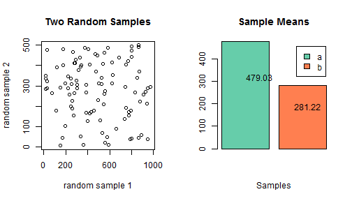

## Agenda


1. Importance of Data Visualization
2. R Code Demo
3. Data Product

--- .class #id 

## Importance of Visualization
Data visualization is the method of consolidating data into one collective, illustrative graphic. Traditionally, data visualization has been used for quantitative work (infographics are a popular example) but ways to represent qualitative work have shown to be equally as powerful.

```
```
Why is data visualization important?

1. Spreadsheets are hard to visualize
2. Data visualization excels in capturing a viewer's attention and holding it through storytelling
3. Data visualization makes interpretation easier


--- &interactive

## Interactive R Code Demo 

```r
#Updates with every call
a <- sample(1:1000,100,replace=T)
b <- sample(0:500,100,replace=T)
e <- c(mean(a),mean(b))
par(mfrow=c(1,2))
plot(a,b,main="Two Random Samples",xlab="random sample 1",ylab="random sample 2")
barplot(e,main="Sample Means",xlab="Samples"
        ,col=c("aquamarine3","coral"),beside=TRUE,legend=c("a","b"))
text(1,mean(a)*2/3,mean(a))
text(2,mean(b)*2/3,mean(b))
```



--- &interactive

## Data Product

<iframe width=620 height=30 frameborder="0"
src="https://aakarshgupta.shinyapps.io/ShinyAssignment/">
</iframe>

References:
1. [SAS][http://www.sas.com/en_us/insights/big-data/data-visualization.html]
2. [Bridgeable][http://bridgeable.com/the-importance-of-data-visualization/]


